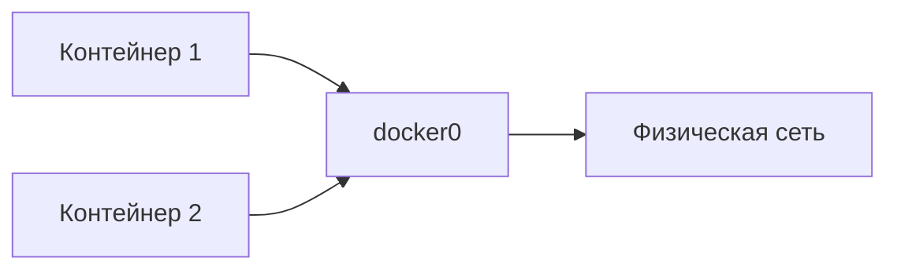

Вот структурированный вариант для Obsidian с использованием callouts, таблиц и тегов:

## Docker

### 1. Что такое Docker? Отличие контейнера от образа
#docker #basics 

> [!summary] Ответ
> **Docker** - ПО для автоматизации развёртывания приложений через контейнеризацию  
> 
> | Концепция      | Описание                                                                 |
> |----------------|--------------------------------------------------------------------------|
> | **Образ**      | Шаблон приложения (read-only слои файловой системы)                      |
> | **Контейнер**  | Запущенный образ + writable слой поверх read-only слоёв                  |
> 
> **Аналогия:**  
> - Образ = ISO-файл  
> - Контейнер = Запущенная виртуальная машина  

---

### 2. Инструкции Dockerfile
#dockerfile #reference 

> [!summary] Основные инструкции
> | Инструкция   | Назначение                                                                 |
> |--------------|----------------------------------------------------------------------------|
> | `FROM`       | Базовый образ                                                              |
> | `LABEL`      | Метаданные (автор, версия)                                                 |
> | `ENV`        | Переменные среды                                                           |
> | `RUN`        | Выполнение команд при сборке                                               |
> | `COPY`       | Копирование файлов с хоста                                                 |
> | `ADD`        | Копирование + распаковка архивов                                           |
> | `CMD`        | Команда по умолчанию при запуске (можно переопределить)                    |
> | `ENTRYPOINT` | Основная исполняемая команда                                               |
> | `WORKDIR`    | Рабочая директория                                                         |
> | `ARG`        | Переменные для времени сборки                                              |
> | `EXPOSE`     | Открытие порта                                                             |
> | `VOLUME`     | Точка монтирования для постоянного хранилища                               |

---

### 3. CMD vs ENTRYPOINT
#dockerfile #commands 

> [!summary] Сравнение
> **CMD**  
> - Стартовая команда по умолчанию  
> - Аргументы **можно** переопределить при запуске контейнера  
> - Только одна инструкция в Dockerfile  
> 
> **ENTRYPOINT**  
> - Основная исполняемая команда  
> - Аргументы **нельзя** переопределить  
> 
> **Комбинирование:**  
> ```dockerfile
> ENTRYPOINT ["ping"]  
> CMD ["8.8.8.8"]  
> ```
> - `ENTRYPOINT` определяет команду  
> - `CMD` задаёт аргументы по умолчанию  
> 
> ![[cmd-vs-entrypoint.png]]

---

### 4. COPY vs ADD
#dockerfile #files 

> [!summary] Различия
> | Инструкция | Возможности                         | Рекомендация               |
> |------------|-------------------------------------|----------------------------|
> | `COPY`     | Только копирование файлов           | **Использовать по умолчанию** |
> | `ADD`      | Копирование + распаковка архивов    | Только для распаковки      |

---

### 5. Best Practices для Dockerfile
#dockerfile #best-practices 

> [!summary] Рекомендации
> 1. **Один процесс на контейнер**  
> 2. **Объединять RUN-команды**:  
>    ```dockerfile
>    RUN apt-get update && \
>        apt-get install -y package && \
>        rm -rf /var/lib/apt/lists/*
>    ```
> 3. **Сортировка слоёв**: Часто меняемые слои - в конец  
> 4. **Фиксировать версии**:  
>    ```dockerfile
>    FROM ubuntu:22.04
>    RUN apt-get install -y package=1.2.3
>    ```
> 5. **Очистка кеша**: Удалять временные файлы в том же слое  
> 6. **Multi-stage build**:  
>    ```dockerfile
>    # Стадия сборки
>    FROM golang:1.18 AS builder
>    ...
>    
>    # Финальный образ
>    FROM alpine:latest
>    COPY --from=builder /app/bin /usr/local/bin
>    ```

---

### 6. Сетевые драйверы Docker
#docker #networking 

> [!summary] Типы драйверов
> | Драйвер      | Назначение                                                                 |
> |--------------|----------------------------------------------------------------------------|
> | `bridge`     | **По умолчанию**. Виртуальный мост между контейнерами (`docker0`)          |
> | `host`       | Прямое использование сети хоста (без изоляции)                             |
> | `none`       | Полное отключение сети                                                     |
> | `overlay`    | Связь между контейнерами на разных хостах (Swarm/Kubernetes)               |
> | `macvlan`    | Назначение MAC-адресов контейнерам (прямое подключение к физической сети) |
> | `ipvlan`     | Продвинутое управление IPv4/IPv6 адресацией                               |
> 
> ![[docker-network-types.png]]

---

### 7. Эфемерные контейнеры
#kubernetes #debugging 

> [!summary] Особенности
> - **Назначение**: Временное подключение к работающим pod для отладки  
> - **Статус**: Бета-функция в Kubernetes v1.23+ (включена по умолчанию)  
> - **Преимущества**:  
>   - Отладка без перезапуска основных контейнеров  
>   - Доступ к пространствам имен целевого pod  
>   - Установка временных диагностических инструментов  
> 
> **Использование**:  
> ```bash
> kubectl debug -it <pod-name> --image=busybox --target=<container-name>
> ```
> 
> [Официальная документация](https://kubernetes.io/docs/concepts/workloads/pods/ephemeral-containers/)
```

### Рекомендации для Obsidian:
1. **Изображения**  
   - Добавьте файлы `cmd-vs-entrypoint.png` и `docker-network-types.png` в папку заметки
   - Для схемы сетей можно использовать [Mermaid-диаграммы](https://mermaid.js.org/)

2. **Теги**  
   Используйте теги для категоризации (#dockerfile, #networking) для создания связей

3. **Callouts**  
   Формат `> [!summary]` создаст сворачиваемые блоки (требует плагина Callouts)

4. **Ссылки**  
   - Внешние ссылки оформлены стандартным маркдаун-синтаксисом
   - Внутренние ссылки на изображения через `![[filename]]`

5. **Таблицы**  
   Для лучшей читаемости таблицы выровнены по колонкам

6. **Диаграммы** (опционально)  
   Для визуализации сетей можно добавить Mermaid-код:


Такой формат обеспечивает:
- Быстрое сканирование информации
- Легкое обновление контента
- Перекрестные ссылки между заметками
- Визуальную структуризацию сложных концепций